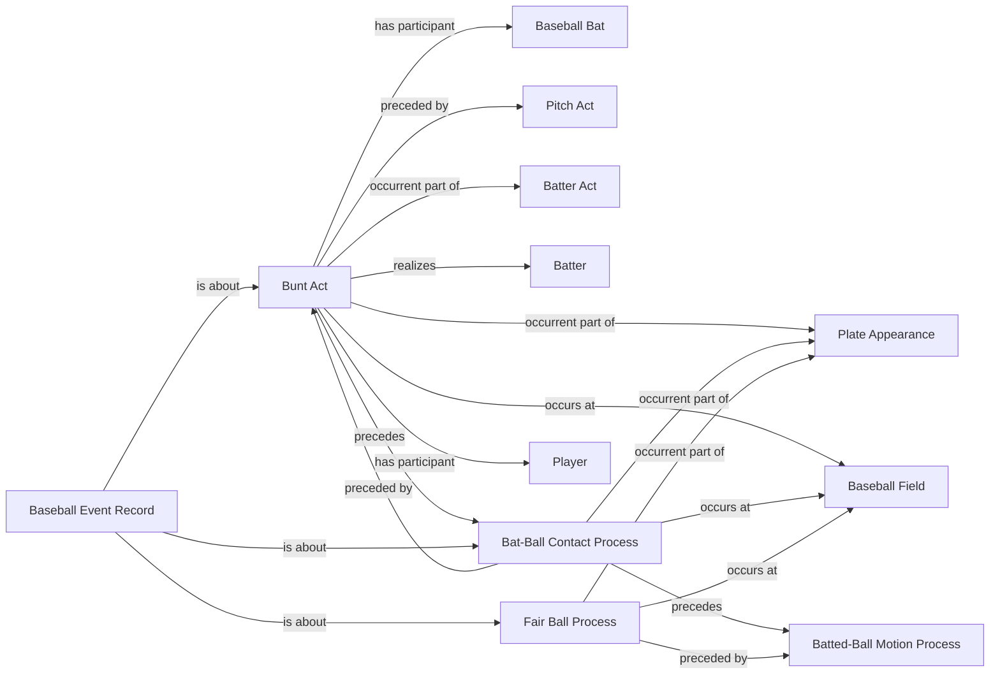

<!-- Generated by scripts/generate_rml_mermaid.py; do not edit. -->
<!-- Mapping SHA-256: ab85db49a66adbcba8c5e82535e3a1824626785795b7c5e3eb7169676c38b3d0 -->

# Bunt contact

A bunt act precedes contact and fair-ball classification without collapsing the act into its resulting processes.

This view shows the ontology pattern without MLB JSON paths or RML machinery.

## RML evidence boundary

Generated from: `BuntActMap`, `BuntContactMap`, `BuntFairBallMap`, `BuntRecordAboutMap`.
