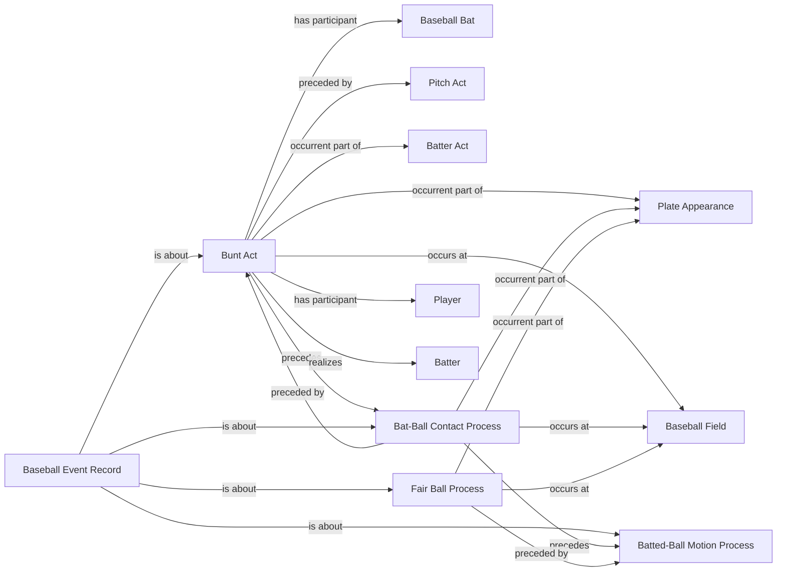

<!-- Generated by scripts/generate_rml_mermaid.py; do not edit. -->
<!-- Mapping SHA-256: 76b433db32acb7e8d69d7aeaabd0b6faa4e1973919c14b99d49047880065e471 -->

# Bunt contact

Every supported bunt attempt creates a Bunt Act; only contact-supported attempts precede contact, and only in-play bunt evidence creates a fair-ball process.

This view shows the ontology pattern without MLB JSON paths or RML machinery.

## RML evidence boundary

Generated from: `BuntActMap`, `BuntActContactSequenceMap`, `BuntContactMap`, `BuntFairBallMap`, `BuntRecordAboutMap`, `BuntContactRecordAboutMap`, `BuntFairBallRecordAboutMap`.
