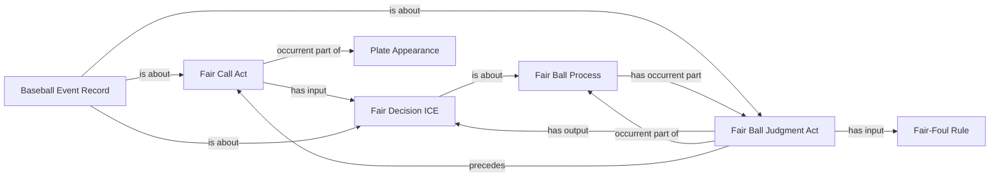

<!-- Generated by scripts/generate_rml_mermaid.py; do not edit. -->
<!-- Mapping SHA-256: a288d8d9e8e638468897751f8eda557afe2f40c2d055fa2acb378682b778531d -->

# Fair-ball adjudication

A fair-ball process contains a judgment that uses the fair/foul rule, produces a decision, and precedes a call act.

This view shows the ontology pattern without MLB JSON paths or RML machinery.

## RML evidence boundary

Generated from: `FairBallProcessAdjudicationPartMap`, `FairBallAdjudicationMap`, `FairBallDecisionMap`, `FairBallCallMap`, `FairBallAdjudicationRecordMap`, `FairFoulRuleMap`.
