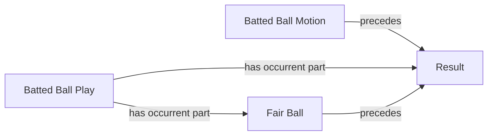

<!-- Generated by scripts/generate_rml_mermaid.py; do not edit. -->
<!-- Mapping SHA-256: a67dbfc25c191c8b89cbb9a38b4e3a3f348374e37180679a6c7c99f69e4088a9 -->

# Batted-ball result sequence

The terminal batted-ball motion and fair-ball classification precede the plate-appearance result, which is contained in the batted-ball play.

This view shows the ontology pattern without MLB JSON paths or RML machinery.

## RML evidence boundary

Generated from: `TerminalBattedBallMotionResultSequenceMap`, `TerminalFairBallResultSequenceMap`, `TerminalBattedBallPlayResultContainmentMap`.
