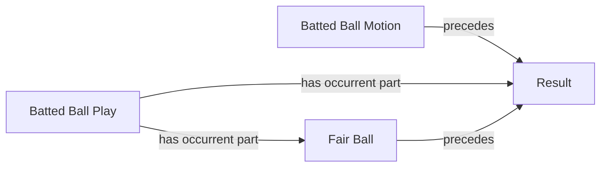

<!-- Generated by scripts/generate_rml_mermaid.py; do not edit. -->
<!-- Mapping SHA-256: 453de892549be95019b4529f875fbd86bd7bd073b32261dd717a096007cf3413 -->

# Batted-ball result sequence

The terminal batted-ball motion and fair-ball classification precede the plate-appearance result, which is contained in the batted-ball play.

This view shows the ontology pattern without MLB JSON paths or RML machinery.

```mermaid
flowchart LR
    N01["Result"]
    N02["Batted Ball Motion"]
    N03["Batted Ball Play"]
    N04["Fair Ball"]
    N02 -->|precedes| N01
    N03 -->|has occurrent part| N01
    N03 -->|has occurrent part| N04
    N04 -->|precedes| N01
```

## RML evidence boundary

Generated from: `TerminalBattedBallMotionResultSequenceMap`, `TerminalFairBallResultSequenceMap`, `TerminalBattedBallPlayResultContainmentMap`.
