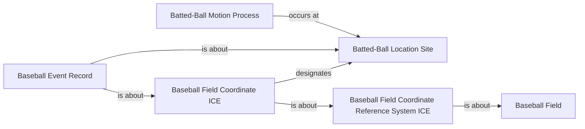

<!-- Generated by scripts/generate_rml_mermaid.py; do not edit. -->
<!-- Mapping SHA-256: a288d8d9e8e638468897751f8eda557afe2f40c2d055fa2acb378682b778531d -->

# Batted-ball coordinate location

A coordinate information entity designates a batted-ball location site in a baseball-field coordinate reference system, and motion occurs at that site.

This view shows the ontology pattern without MLB JSON paths or RML machinery.

## RML evidence boundary

Generated from: `BaseballFieldCoordinateReferenceSystemMap`, `BattedBallCoordinateICEMap`, `BattedBallLocationSiteMap`, `BattedBallMotionLocationMap`, `BattedBallCoordinateRecordMap`.
