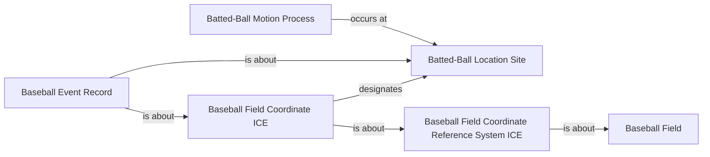

<!-- Generated by scripts/generate_rml_mermaid.py; do not edit. -->
<!-- Mapping SHA-256: bc17e2b9f57294d3456d628659686c0b73a95287999ec6cb26d7fb99be7f00f7 -->

# Batted-ball coordinate location

A coordinate information entity designates a batted-ball location site in a baseball-field coordinate reference system, and motion occurs at that site.

This view shows the ontology pattern without MLB JSON paths or RML machinery.

## RML evidence boundary

Generated from: `BaseballFieldCoordinateReferenceSystemMap`, `BattedBallCoordinateICEMap`, `BattedBallLocationSiteMap`, `BattedBallMotionLocationMap`, `BattedBallCoordinateRecordMap`.
