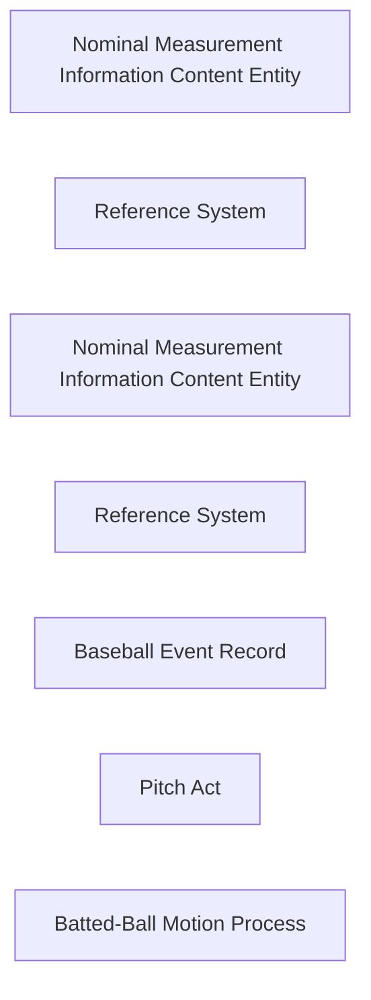

<!-- Generated by scripts/generate_rml_mermaid.py; do not edit. -->
<!-- Mapping SHA-256: bca42ec534c9be7569f69d0fa65d49406cb4139125c1720503fdd2756abefb40 -->

# Nominal pitch and batted-ball trajectory classification

A pitch or batted-ball motion is measured by a reusable nominal category ICE in a response-versioned Reference System; no provider coordinate is projected into a world-side Site.

This view shows the ontology pattern without MLB JSON paths or RML machinery.

## RML evidence boundary

Generated from: `PitchTypeReferenceSystemMap`, `PitchTypeClassificationMap`, `PitchTypeCategoryMap`, `PitchTypeClassificationRecordMap`, `BattedTrajectoryReferenceSystemMap`, `BattedTrajectoryClassificationMap`, `BattedTrajectoryCategoryMap`, `BattedTrajectoryClassificationRecordMap`.
