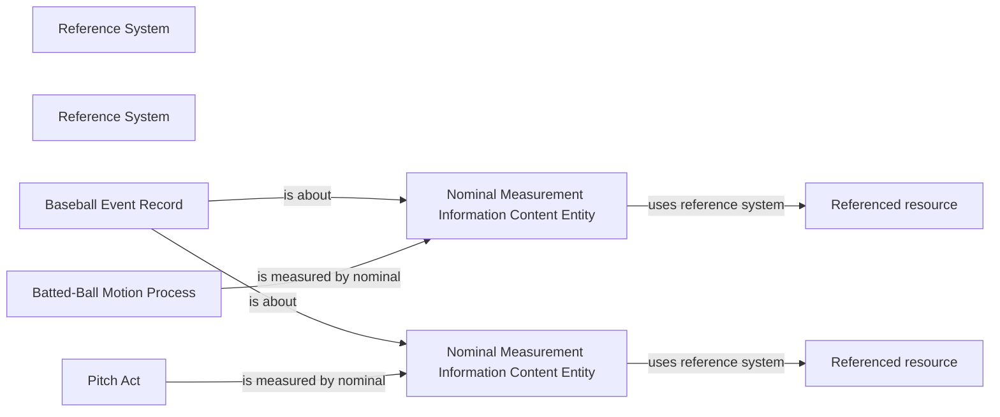

<!-- Generated by scripts/generate_rml_mermaid.py; do not edit. -->
<!-- Mapping SHA-256: 9dda8b5110491293e9b7c93625275eca382790b5a0be0147b2781cea4a2d4a47 -->

# Nominal pitch and batted-ball trajectory classification

A pitch or batted-ball motion is measured by a reusable nominal category ICE in a response-versioned Reference System; no provider coordinate is projected into a world-side Site.

This view shows the ontology pattern without MLB JSON paths or RML machinery.

## RML evidence boundary

Generated from: `PitchTypeReferenceSystemMap`, `PitchTypeClassificationMap`, `PitchTypeCategoryMap`, `PitchTypeClassificationRecordMap`, `BattedTrajectoryReferenceSystemMap`, `BattedTrajectoryClassificationMap`, `BattedTrajectoryCategoryMap`, `BattedTrajectoryClassificationRecordMap`.
