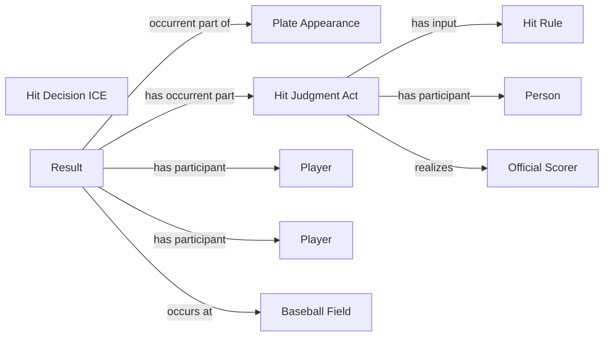

<!-- Generated by scripts/generate_rml_mermaid.py; do not edit. -->
<!-- Mapping SHA-256: 0525c6bf4b5afe22d7f8ed5ae6ba27fe96831e3a0765c0c3bf5a615539bc1189 -->

# Counted hit results

Single, double, triple, and home-run result types share a scorer-supported hit judgment and decision while remaining distinct result classes.

This view shows the ontology pattern without MLB JSON paths or RML machinery.

## RML evidence boundary

Generated from: `PlateAppearanceResultMap`, `ResultType_single`, `ResultType_double`, `ResultType_triple`, `ResultType_home_run`, `HitResultJudgmentOverlayMap`, `HitResultDecisionOverlayMap`, `HitRuleMap`.
