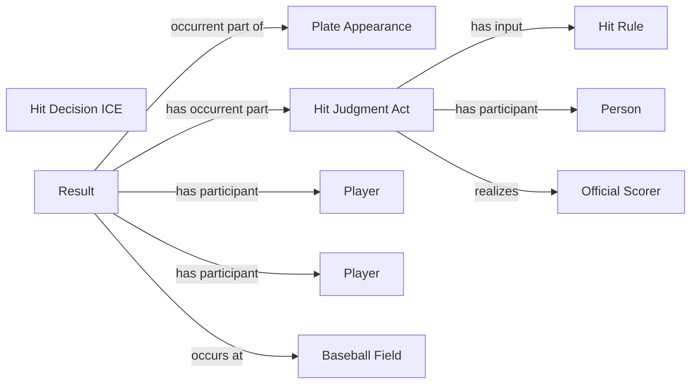

<!-- Generated by scripts/generate_rml_mermaid.py; do not edit. -->
<!-- Mapping SHA-256: 57a5cb1a54e46ee26b27f101cb1468292932df060b1f72c51331c0d029f8c2b5 -->

# Counted hit results

Single, double, triple, and home-run result types share a scorer-supported hit judgment and decision while remaining distinct result classes.

This view shows the ontology pattern without MLB JSON paths or RML machinery.

## RML evidence boundary

Generated from: `PlateAppearanceResultMap`, `ResultType_single`, `ResultType_double`, `ResultType_triple`, `ResultType_home_run`, `HitResultJudgmentOverlayMap`, `HitResultDecisionOverlayMap`, `HitRuleMap`.
