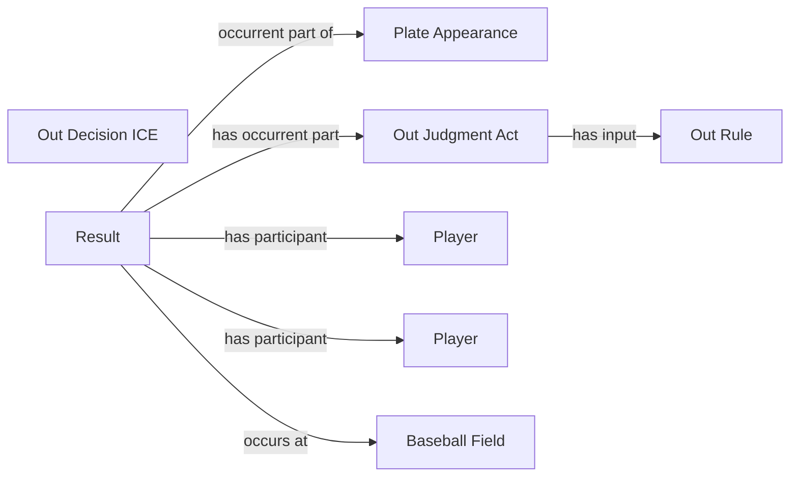

<!-- Generated by scripts/generate_rml_mermaid.py; do not edit. -->
<!-- Mapping SHA-256: 897a41688f0cd36aa8d0b3a8112c132b2c4a4f3e779505192f51b33870df8cea -->

# Counted out results

Batted outs, force outs, strikeouts, double plays, and grounded-into-double-play results share an out adjudication overlay.

This view shows the ontology pattern without MLB JSON paths or RML machinery.

## RML evidence boundary

Generated from: `PlateAppearanceResultMap`, `ResultType_field_out`, `ResultType_force_out`, `ResultType_strikeout`, `ResultType_double_play`, `ResultType_grounded_into_double_play`, `OutResultJudgmentOverlayMap`, `OutResultDecisionOverlayMap`, `OutRuleMap`.
