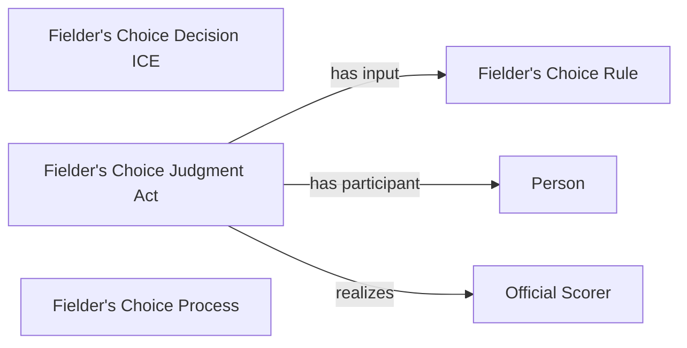

<!-- Generated by scripts/generate_rml_mermaid.py; do not edit. -->
<!-- Mapping SHA-256: f1f0054989fa91a76b8aa21a857f8b08cdeea24a88177e68a5ec0bb7ad0c493e -->

# Fielder's-choice result

A fielder's-choice result carries its own judgment and decision using the fielder's-choice rule.

This view shows the ontology pattern without MLB JSON paths or RML machinery.

## RML evidence boundary

Generated from: `ResultType_fielders_choice`, `FieldersChoiceJudgmentOverlayMap`, `FieldersChoiceDecisionOverlayMap`, `FieldersChoiceRuleMap`.
