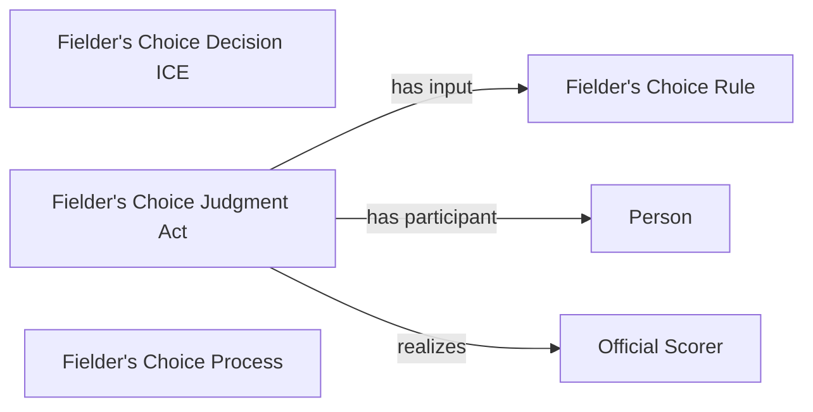

<!-- Generated by scripts/generate_rml_mermaid.py; do not edit. -->
<!-- Mapping SHA-256: bc17e2b9f57294d3456d628659686c0b73a95287999ec6cb26d7fb99be7f00f7 -->

# Fielder's-choice result

A fielder's-choice result carries its own judgment and decision using the fielder's-choice rule.

This view shows the ontology pattern without MLB JSON paths or RML machinery.

## RML evidence boundary

Generated from: `ResultType_fielders_choice`, `FieldersChoiceJudgmentOverlayMap`, `FieldersChoiceDecisionOverlayMap`, `FieldersChoiceRuleMap`.
