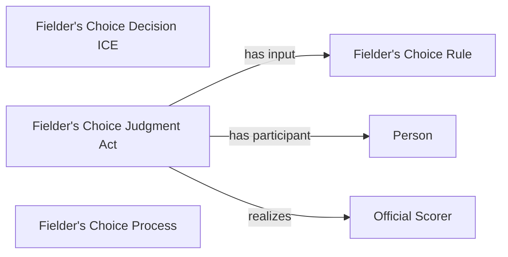

<!-- Generated by scripts/generate_rml_mermaid.py; do not edit. -->
<!-- Mapping SHA-256: 475f4c47f3b0bb3941dc4380421823ad817aec29e827ff53c3a606a354c62018 -->

# Fielder's-choice result

A fielder's-choice result carries its own judgment and decision using the fielder's-choice rule.

This view shows the ontology pattern without MLB JSON paths or RML machinery.

## RML evidence boundary

Generated from: `ResultType_fielders_choice`, `FieldersChoiceJudgmentOverlayMap`, `FieldersChoiceDecisionOverlayMap`, `FieldersChoiceRuleMap`.
