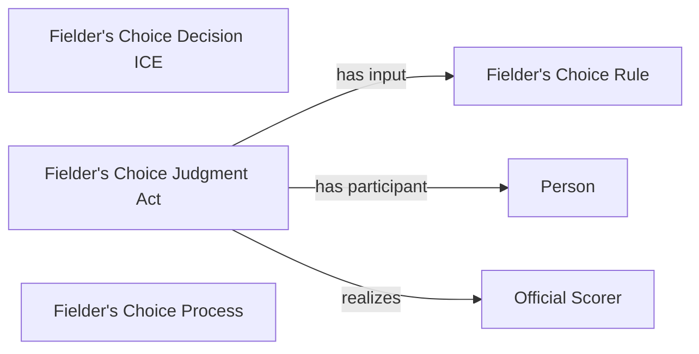

<!-- Generated by scripts/generate_rml_mermaid.py; do not edit. -->
<!-- Mapping SHA-256: bca42ec534c9be7569f69d0fa65d49406cb4139125c1720503fdd2756abefb40 -->

# Fielder's-choice result

A fielder's-choice result carries its own judgment and decision using the fielder's-choice rule.

This view shows the ontology pattern without MLB JSON paths or RML machinery.

## RML evidence boundary

Generated from: `ResultType_fielders_choice`, `FieldersChoiceJudgmentOverlayMap`, `FieldersChoiceDecisionOverlayMap`, `FieldersChoiceRuleMap`.
