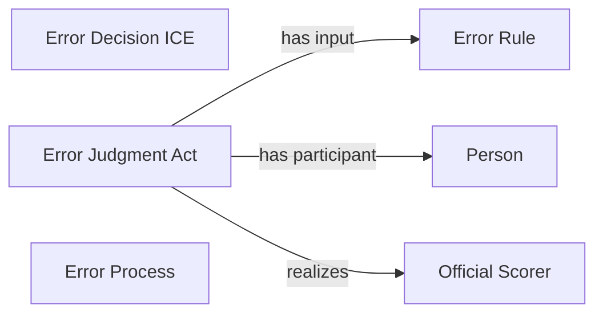

<!-- Generated by scripts/generate_rml_mermaid.py; do not edit. -->
<!-- Mapping SHA-256: a288d8d9e8e638468897751f8eda557afe2f40c2d055fa2acb378682b778531d -->

# Error result

A field-error result carries scorer-supported error judgment and decision information using the error rule.

This view shows the ontology pattern without MLB JSON paths or RML machinery.

## RML evidence boundary

Generated from: `ResultType_field_error`, `ErrorJudgmentOverlayMap`, `ErrorDecisionOverlayMap`, `ErrorRuleMap`.
