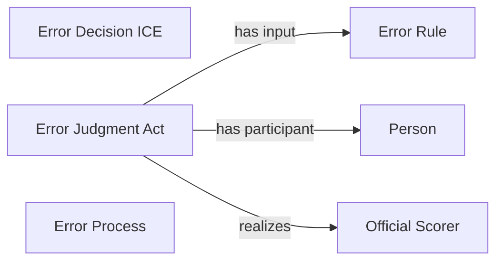

<!-- Generated by scripts/generate_rml_mermaid.py; do not edit. -->
<!-- Mapping SHA-256: 475f4c47f3b0bb3941dc4380421823ad817aec29e827ff53c3a606a354c62018 -->

# Error result

A field-error result carries scorer-supported error judgment and decision information using the error rule.

This view shows the ontology pattern without MLB JSON paths or RML machinery.

## RML evidence boundary

Generated from: `ResultType_field_error`, `ErrorJudgmentOverlayMap`, `ErrorDecisionOverlayMap`, `ErrorRuleMap`.
