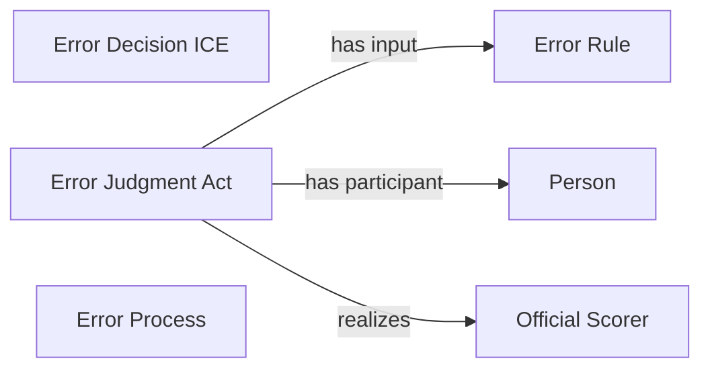

<!-- Generated by scripts/generate_rml_mermaid.py; do not edit. -->
<!-- Mapping SHA-256: bc17e2b9f57294d3456d628659686c0b73a95287999ec6cb26d7fb99be7f00f7 -->

# Error result

A field-error result carries scorer-supported error judgment and decision information using the error rule.

This view shows the ontology pattern without MLB JSON paths or RML machinery.

## RML evidence boundary

Generated from: `ResultType_field_error`, `ErrorJudgmentOverlayMap`, `ErrorDecisionOverlayMap`, `ErrorRuleMap`.
