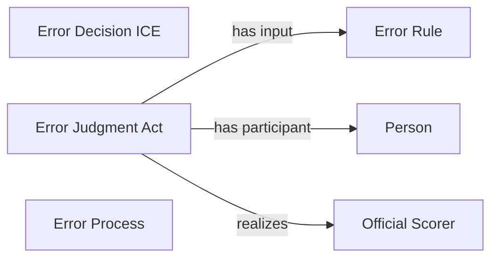

<!-- Generated by scripts/generate_rml_mermaid.py; do not edit. -->
<!-- Mapping SHA-256: 453de892549be95019b4529f875fbd86bd7bd073b32261dd717a096007cf3413 -->

# Error result

A field-error result carries scorer-supported error judgment and decision information using the error rule.

This view shows the ontology pattern without MLB JSON paths or RML machinery.

```mermaid
flowchart LR
    N01["Error Rule"]
    N02["Error Decision ICE"]
    N03["Error Judgment Act"]
    N04["Error Process"]
    N05["Person"]
    N06["Official Scorer"]
    N03 -->|has input| N01
    N03 -->|has participant| N05
    N03 -->|realizes| N06
```

## RML evidence boundary

Generated from: `ResultType_field_error`, `ErrorJudgmentOverlayMap`, `ErrorDecisionOverlayMap`, `ErrorRuleMap`.
