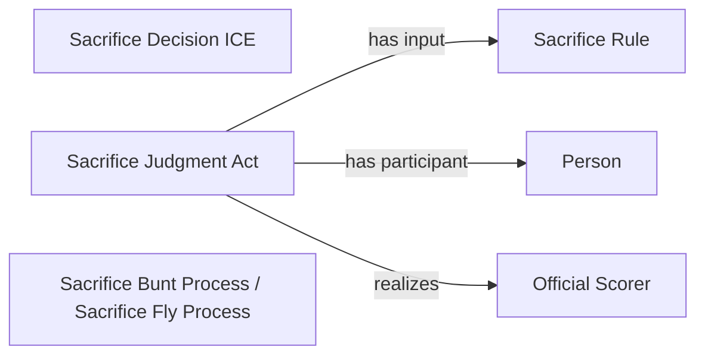

<!-- Generated by scripts/generate_rml_mermaid.py; do not edit. -->
<!-- Mapping SHA-256: ab85db49a66adbcba8c5e82535e3a1824626785795b7c5e3eb7169676c38b3d0 -->

# Sacrifice results

Sacrifice-fly and sacrifice-bunt result types share a sacrifice judgment and decision overlay.

This view shows the ontology pattern without MLB JSON paths or RML machinery.

## RML evidence boundary

Generated from: `ResultType_sac_fly`, `ResultType_sac_bunt`, `SacrificeJudgmentOverlayMap`, `SacrificeDecisionOverlayMap`, `SacrificeRuleMap`.
