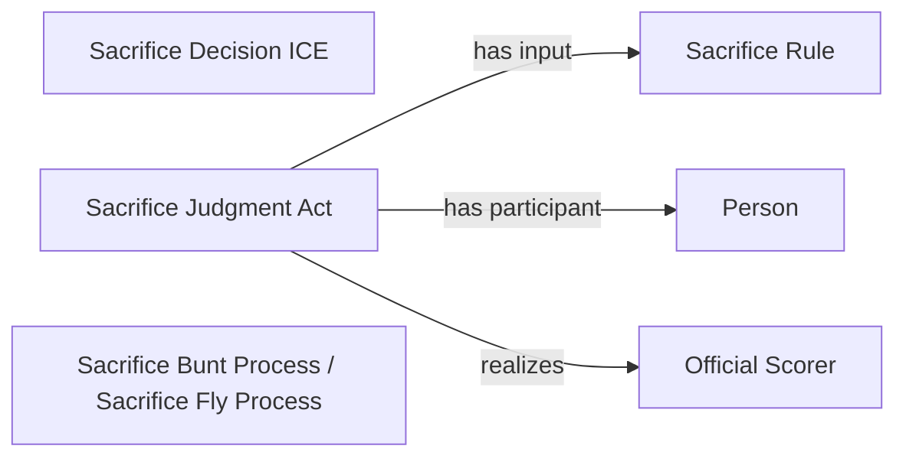

<!-- Generated by scripts/generate_rml_mermaid.py; do not edit. -->
<!-- Mapping SHA-256: ca2bfcd3533f154819be7138ce97981ad9af101d0152bc154d5eac8049dde31a -->

# Sacrifice results

Sacrifice-fly and sacrifice-bunt result types share a sacrifice judgment and decision overlay.

This view shows the ontology pattern without MLB JSON paths or RML machinery.

## RML evidence boundary

Generated from: `ResultType_sac_fly`, `ResultType_sac_bunt`, `SacrificeJudgmentOverlayMap`, `SacrificeDecisionOverlayMap`, `SacrificeRuleMap`.
