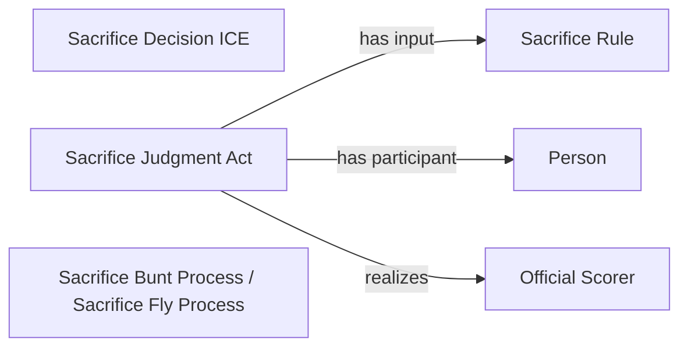

<!-- Generated by scripts/generate_rml_mermaid.py; do not edit. -->
<!-- Mapping SHA-256: b03778b5ebd23db89b7abb1fe4acc13dc3fede4868509ac82ab8ef3e00b59929 -->

# Sacrifice results

Sacrifice-fly and sacrifice-bunt result types share a sacrifice judgment and decision overlay.

This view shows the ontology pattern without MLB JSON paths or RML machinery.

```mermaid
flowchart LR
    N01["Sacrifice Rule"]
    N02["Sacrifice Decision ICE"]
    N03["Sacrifice Judgment Act"]
    N04["Sacrifice Bunt Process / Sacrifice Fly Process"]
    N05["Person"]
    N06["Official Scorer"]
    N03 -->|has input| N01
    N03 -->|has participant| N05
    N03 -->|realizes| N06
```

## RML evidence boundary

Generated from: `ResultType_sac_fly`, `ResultType_sac_bunt`, `SacrificeJudgmentOverlayMap`, `SacrificeDecisionOverlayMap`, `SacrificeRuleMap`.
