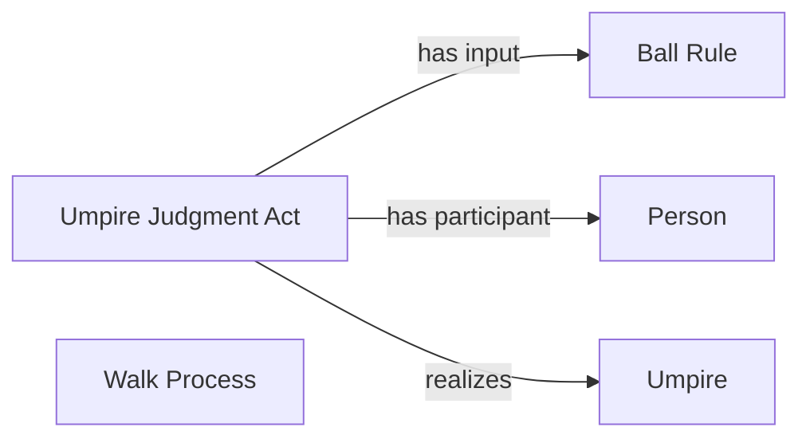

<!-- Generated by scripts/generate_rml_mermaid.py; do not edit. -->
<!-- Mapping SHA-256: a2469ac1f5a25943b6069f2873eb4b91992150a34aa29eb87cf656c8d5089893 -->

# Walk result

A walk is a specific plate-appearance result with a source-supported umpire judgment overlay.

This view shows the ontology pattern without MLB JSON paths or RML machinery.

## RML evidence boundary

Generated from: `ResultType_walk`, `WalkResultJudgmentOverlayMap`.
