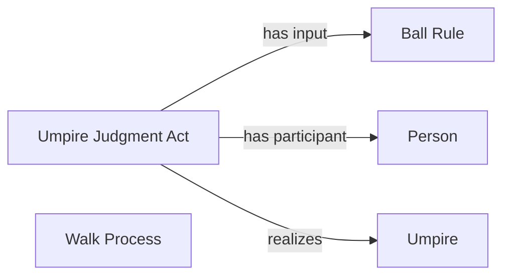

<!-- Generated by scripts/generate_rml_mermaid.py; do not edit. -->
<!-- Mapping SHA-256: 37e351d9222ab97ed1a8846f3c69bbfbd97ce933eba9ffa0215d9dddc77f8211 -->

# Walk result

A walk is a specific plate-appearance result with a source-supported umpire judgment overlay.

This view shows the ontology pattern without MLB JSON paths or RML machinery.

```mermaid
flowchart LR
    N01["Ball Rule"]
    N02["Umpire Judgment Act"]
    N03["Walk Process"]
    N04["Person"]
    N05["Umpire"]
    N02 -->|has input| N01
    N02 -->|has participant| N04
    N02 -->|realizes| N05
```

## RML evidence boundary

Generated from: `ResultType_walk`, `WalkResultJudgmentOverlayMap`.
