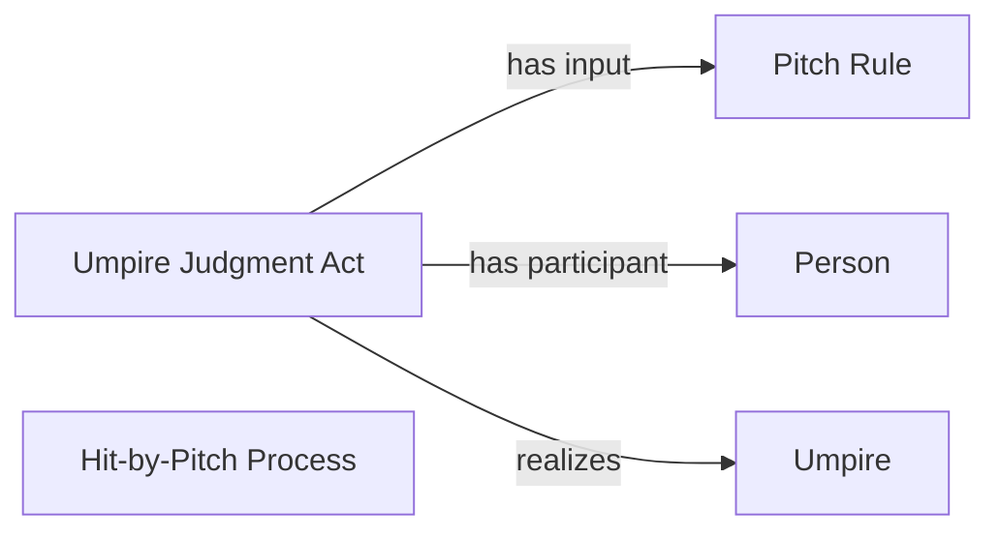

<!-- Generated by scripts/generate_rml_mermaid.py; do not edit. -->
<!-- Mapping SHA-256: a67dbfc25c191c8b89cbb9a38b4e3a3f348374e37180679a6c7c99f69e4088a9 -->

# Hit-by-pitch result

Hit by pitch is a specific plate-appearance result with a source-supported umpire judgment overlay.

This view shows the ontology pattern without MLB JSON paths or RML machinery.

## RML evidence boundary

Generated from: `ResultType_hit_by_pitch`, `HitByPitchResultJudgmentOverlayMap`.
