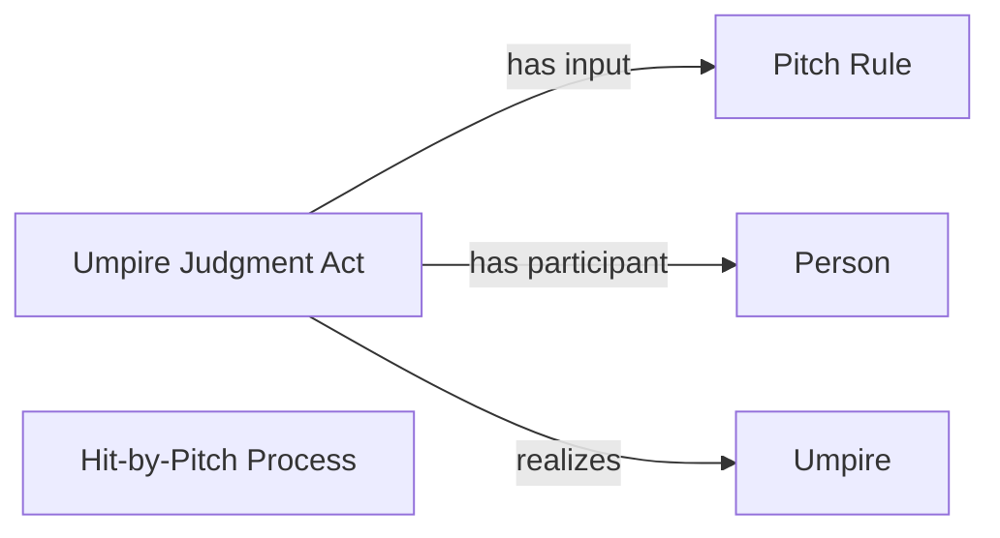

<!-- Generated by scripts/generate_rml_mermaid.py; do not edit. -->
<!-- Mapping SHA-256: 453de892549be95019b4529f875fbd86bd7bd073b32261dd717a096007cf3413 -->

# Hit-by-pitch result

Hit by pitch is a specific plate-appearance result with a source-supported umpire judgment overlay.

This view shows the ontology pattern without MLB JSON paths or RML machinery.

```mermaid
flowchart LR
    N01["Pitch Rule"]
    N02["Umpire Judgment Act"]
    N03["Hit-by-Pitch Process"]
    N04["Person"]
    N05["Umpire"]
    N02 -->|has input| N01
    N02 -->|has participant| N04
    N02 -->|realizes| N05
```

## RML evidence boundary

Generated from: `ResultType_hit_by_pitch`, `HitByPitchResultJudgmentOverlayMap`.
