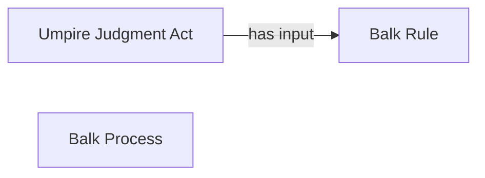

<!-- Generated by scripts/generate_rml_mermaid.py; do not edit. -->
<!-- Mapping SHA-256: 37e351d9222ab97ed1a8846f3c69bbfbd97ce933eba9ffa0215d9dddc77f8211 -->

# Balk result

A balk result carries an umpire judgment using the balk rule.

This view shows the ontology pattern without MLB JSON paths or RML machinery.

```mermaid
flowchart LR
    N01["Balk Rule"]
    N02["Umpire Judgment Act"]
    N03["Balk Process"]
    N02 -->|has input| N01
```

## RML evidence boundary

Generated from: `ResultType_balk`, `BalkResultJudgmentOverlayMap`, `BalkRuleMap`.
