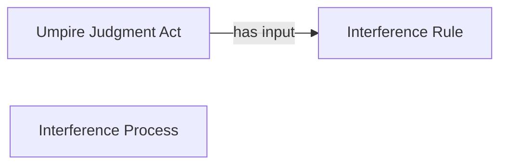

<!-- Generated by scripts/generate_rml_mermaid.py; do not edit. -->
<!-- Mapping SHA-256: 9dda8b5110491293e9b7c93625275eca382790b5a0be0147b2781cea4a2d4a47 -->

# Interference result

A catcher-interference result carries an umpire judgment using the interference rule.

This view shows the ontology pattern without MLB JSON paths or RML machinery.

## RML evidence boundary

Generated from: `ResultType_interference`, `InterferenceResultJudgmentOverlayMap`, `InterferenceRuleMap`.
