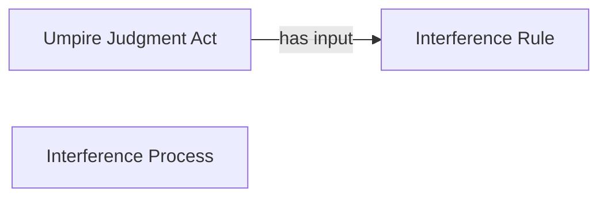

<!-- Generated by scripts/generate_rml_mermaid.py; do not edit. -->
<!-- Mapping SHA-256: a288d8d9e8e638468897751f8eda557afe2f40c2d055fa2acb378682b778531d -->

# Interference result

A catcher-interference result carries an umpire judgment using the interference rule.

This view shows the ontology pattern without MLB JSON paths or RML machinery.

## RML evidence boundary

Generated from: `ResultType_interference`, `InterferenceResultJudgmentOverlayMap`, `InterferenceRuleMap`.
