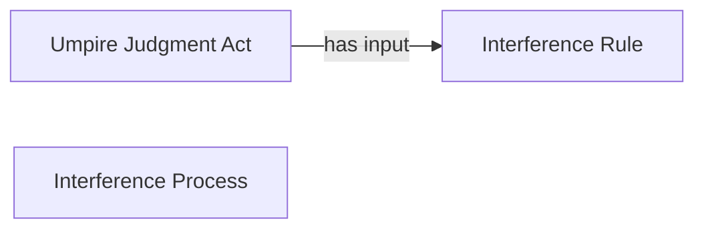

<!-- Generated by scripts/generate_rml_mermaid.py; do not edit. -->
<!-- Mapping SHA-256: b86d60ac423bd023ec39f89c839b4c882479b3c3016924fdbf4ad2fd754b765e -->

# Interference result

A catcher-interference result carries an umpire judgment using the interference rule.

This view shows the ontology pattern without MLB JSON paths or RML machinery.

```mermaid
flowchart LR
    N01["Interference Rule"]
    N02["Umpire Judgment Act"]
    N03["Interference Process"]
    N02 -->|has input| N01
```

## RML evidence boundary

Generated from: `ResultType_interference`, `InterferenceResultJudgmentOverlayMap`, `InterferenceRuleMap`.
