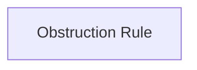

<!-- Generated by scripts/generate_rml_mermaid.py; do not edit. -->
<!-- Mapping SHA-256: 89fae0584eead88666541bd9f84897d45347f7ef9f863ecbfaff003daa8dccf1 -->

# Obstruction rule boundary

The obstruction rule individual is available, but the active source mapping has no result pattern that safely invokes it.

This view shows the ontology pattern without MLB JSON paths or RML machinery.

```mermaid
flowchart LR
    N01["Obstruction Rule"]
```

## RML evidence boundary

Generated from: `ObstructionRuleMap`.
