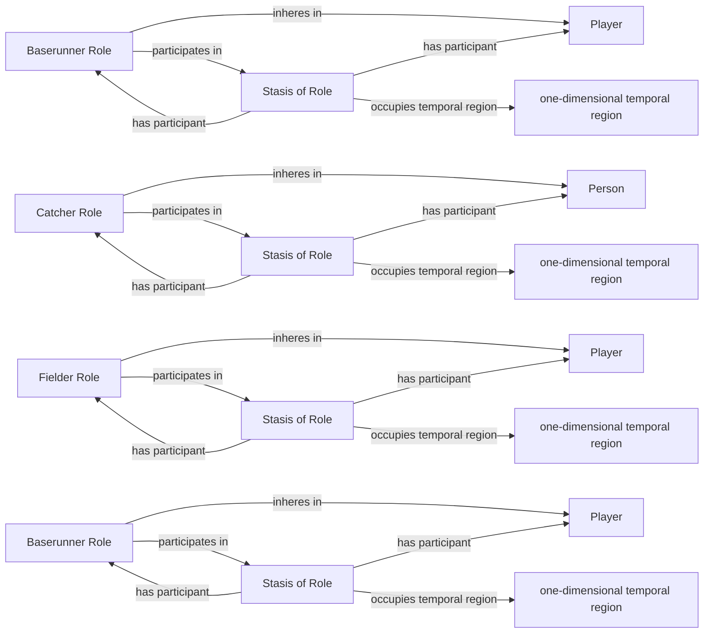

<!-- Generated by scripts/generate_rml_mermaid.py; do not edit. -->
<!-- Mapping SHA-256: b89377d634df094aef78de708e811ac44b66284dbbc0ba86bb21cde578077127 -->

# Persistent fielding, catching, and baserunning roles

Players bear persistent fielder, catcher, and baserunner roles whose open stases remain distinct from the players and roles.

This view shows the ontology pattern without MLB JSON paths or RML machinery.

## RML evidence boundary

Generated from: `BaserunnerRoleMap`, `BaserunnerRoleStasisMap`, `BaserunnerRoleStasisIntervalMap`, `StartOccupancyBaserunnerRoleMap`, `StartOccupancyBaserunnerRoleStasisMap`, `StartOccupancyBaserunnerRoleStasisIntervalMap`, `FielderRoleMap`, `FielderRoleStasisMap`, `FielderRoleStasisIntervalMap`, `CatcherRoleMap`, `CatcherRoleStasisMap`, `CatcherRoleStasisIntervalMap`.
