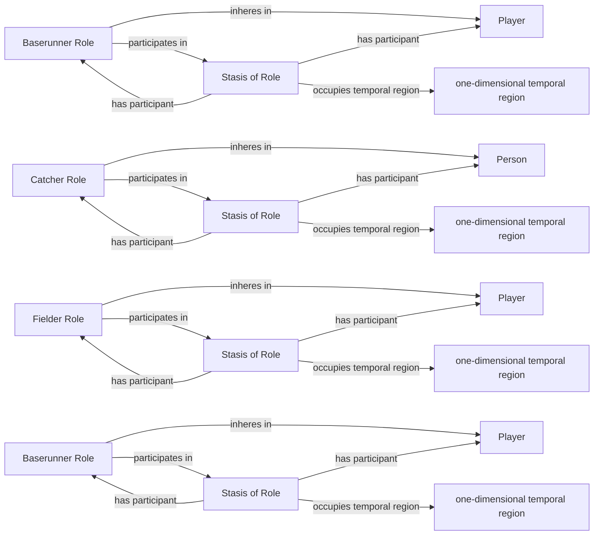

<!-- Generated by scripts/generate_rml_mermaid.py; do not edit. -->
<!-- Mapping SHA-256: 37e351d9222ab97ed1a8846f3c69bbfbd97ce933eba9ffa0215d9dddc77f8211 -->

# Persistent fielding, catching, and baserunning roles

Players bear persistent fielder, catcher, and baserunner roles whose open stases remain distinct from the players and roles.

This view shows the ontology pattern without MLB JSON paths or RML machinery.

```mermaid
flowchart LR
    N01["Player"]
    N02["Baserunner Role"]
    N03["Stasis of Role"]
    N04["one-dimensional temporal region"]
    N05["Person"]
    N06["Catcher Role"]
    N07["Stasis of Role"]
    N08["one-dimensional temporal region"]
    N09["Player"]
    N10["Fielder Role"]
    N11["Stasis of Role"]
    N12["one-dimensional temporal region"]
    N13["Player"]
    N14["Baserunner Role"]
    N15["Stasis of Role"]
    N16["one-dimensional temporal region"]
    N02 -->|inheres in| N01
    N02 -->|participates in| N03
    N03 -->|has participant| N01
    N03 -->|has participant| N02
    N03 -->|occupies temporal region| N04
    N06 -->|inheres in| N05
    N06 -->|participates in| N07
    N07 -->|has participant| N05
    N07 -->|has participant| N06
    N07 -->|occupies temporal region| N08
    N10 -->|inheres in| N09
    N10 -->|participates in| N11
    N11 -->|has participant| N09
    N11 -->|has participant| N10
    N11 -->|occupies temporal region| N12
    N14 -->|inheres in| N13
    N14 -->|participates in| N15
    N15 -->|has participant| N13
    N15 -->|has participant| N14
    N15 -->|occupies temporal region| N16
```

## RML evidence boundary

Generated from: `BaserunnerRoleMap`, `BaserunnerRoleStasisMap`, `BaserunnerRoleStasisIntervalMap`, `StartOccupancyBaserunnerRoleMap`, `StartOccupancyBaserunnerRoleStasisMap`, `StartOccupancyBaserunnerRoleStasisIntervalMap`, `FielderRoleMap`, `FielderRoleStasisMap`, `FielderRoleStasisIntervalMap`, `CatcherRoleMap`, `CatcherRoleStasisMap`, `CatcherRoleStasisIntervalMap`.
