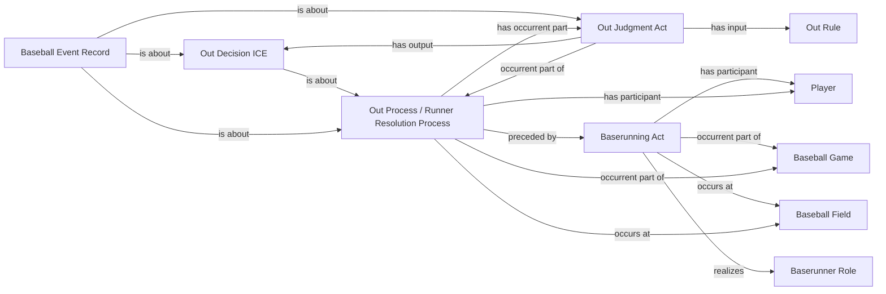

<!-- Generated by scripts/generate_rml_mermaid.py; do not edit. -->
<!-- Mapping SHA-256: a288d8d9e8e638468897751f8eda557afe2f40c2d055fa2acb378682b778531d -->

# Runner out

A baserunning act precedes an out resolution containing an out judgment and decision described by a separate event record.

This view shows the ontology pattern without MLB JSON paths or RML machinery.

## RML evidence boundary

Generated from: `RunnerOutActMap`, `RunnerOutResolutionMap`, `RunnerOutJudgmentMap`, `RunnerOutDecisionMap`, `RunnerOutAdjudicationLinksMap`, `RunnerOutRecordMap`, `RunnerOutRecordAdjudicationMap`, `OutRuleMap`.
