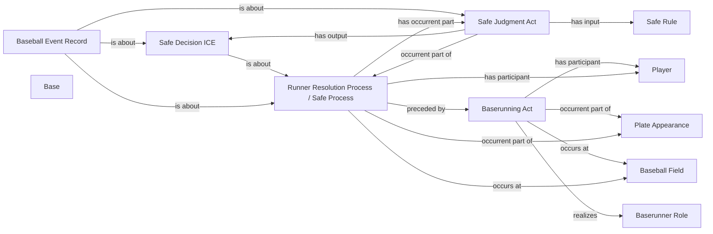

<!-- Generated by scripts/generate_rml_mermaid.py; do not edit. -->
<!-- Mapping SHA-256: ef70601419120731d914fe59980ec1dbefa4ce070f2bbca8ce5b46dbea3cb112 -->

# Runner reaches a base

A baserunning act precedes an institutional safe resolution with judgment, decision, reached-base artifact, and record; movement.end does not assert physical base touching.

This view shows the ontology pattern without MLB JSON paths or RML machinery.

## RML evidence boundary

Generated from: `RunnerReachActMap`, `RunnerReachResolutionMap`, `RunnerReachJudgmentMap`, `RunnerReachDecisionMap`, `RunnerReachAdjudicationLinksMap`, `ReachedBaseArtifactMap`, `RunnerReachRecordMap`, `RunnerReachRecordAdjudicationMap`, `SafeRuleMap`.
