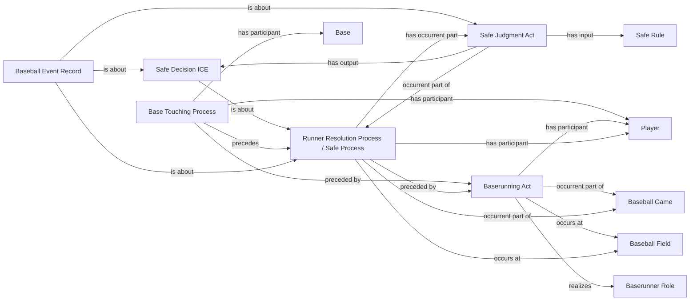

<!-- Generated by scripts/generate_rml_mermaid.py; do not edit. -->
<!-- Mapping SHA-256: a288d8d9e8e638468897751f8eda557afe2f40c2d055fa2acb378682b778531d -->

# Runner advances between bases

A baserunning act precedes base touching and a safe resolution with judgment, decision, destination-base artifact, and record.

This view shows the ontology pattern without MLB JSON paths or RML machinery.

## RML evidence boundary

Generated from: `RunnerAdvanceActMap`, `RunnerAdvanceBaseTouchingMap`, `RunnerAdvanceResolutionMap`, `RunnerAdvanceJudgmentMap`, `RunnerAdvanceDecisionMap`, `RunnerAdvanceAdjudicationLinksMap`, `AdvancedToBaseArtifactMap`, `RunnerAdvanceRecordMap`, `RunnerAdvanceRecordAdjudicationMap`, `SafeRuleMap`.
