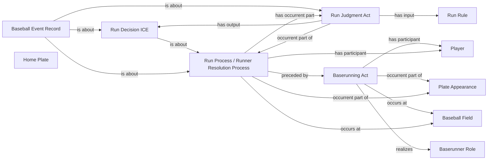

<!-- Generated by scripts/generate_rml_mermaid.py; do not edit. -->
<!-- Mapping SHA-256: 55c45ecc9df86d579681cfa026c088b432d3de03bbb7b6183ebb6c6fdd04c5dd -->

# Runner scores from an origin

A baserunning act from a non-base origin precedes an institutional run resolution with judgment, decision, and record; scoring does not by itself assert physical home-plate touching.

This view shows the ontology pattern without MLB JSON paths or RML machinery.

## RML evidence boundary

Generated from: `RunnerScoreOriginActMap`, `RunnerScoreOriginResolutionMap`, `RunnerScoreOriginJudgmentMap`, `RunnerScoreOriginDecisionMap`, `RunnerScoreOriginAdjudicationLinksMap`, `RunnerScoreOriginRecordMap`, `RunnerScoreOriginRecordAdjudicationMap`, `HomePlateArtifactMap`, `RunRuleMap`.
