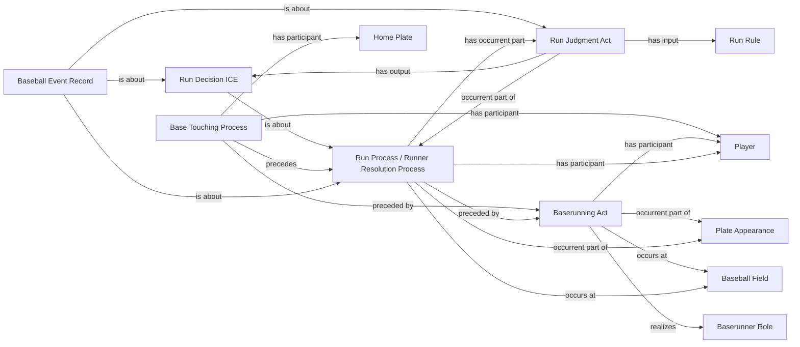

<!-- Generated by scripts/generate_rml_mermaid.py; do not edit. -->
<!-- Mapping SHA-256: ca2bfcd3533f154819be7138ce97981ad9af101d0152bc154d5eac8049dde31a -->

# Runner scores from a base

A baserunning act from a base precedes home-plate touching and a run resolution with judgment, decision, and record.

This view shows the ontology pattern without MLB JSON paths or RML machinery.

## RML evidence boundary

Generated from: `RunnerScoreBaseActMap`, `RunnerScoreBaseHomeTouchingMap`, `RunnerScoreBaseResolutionMap`, `RunnerScoreBaseJudgmentMap`, `RunnerScoreBaseDecisionMap`, `RunnerScoreBaseAdjudicationLinksMap`, `RunnerScoreBaseRecordMap`, `RunnerScoreBaseRecordAdjudicationMap`, `HomePlateArtifactMap`, `RunRuleMap`.
