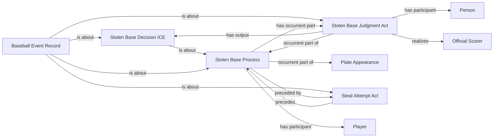

<!-- Generated by scripts/generate_rml_mermaid.py; do not edit. -->
<!-- Mapping SHA-256: ef70601419120731d914fe59980ec1dbefa4ce070f2bbca8ce5b46dbea3cb112 -->

# Stolen base and caught stealing

A neutral steal-attempt act may support a distinct stolen-base process and adjudication; caught stealing retains the attempt without asserting success.

This view shows the ontology pattern without MLB JSON paths or RML machinery.

## RML evidence boundary

Generated from: `StolenBaseAttemptOverlayMap`, `StolenBaseProcessMap`, `StolenBaseJudgmentMap`, `StolenBaseDecisionMap`, `StolenBaseRecordMap`, `CaughtStealingAttemptOverlayMap`.
