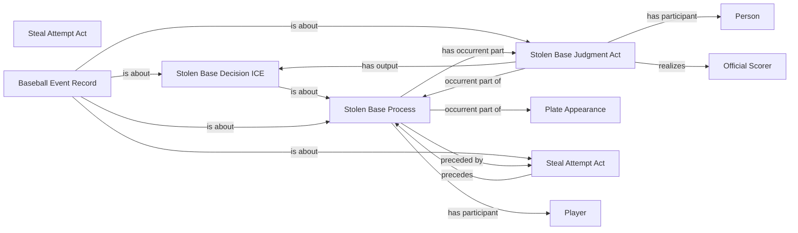

<!-- Generated by scripts/generate_rml_mermaid.py; do not edit. -->
<!-- Mapping SHA-256: 453de892549be95019b4529f875fbd86bd7bd073b32261dd717a096007cf3413 -->

# Stolen base and caught stealing

A neutral steal-attempt act may support a distinct stolen-base process and adjudication; caught stealing retains the attempt without asserting success. Positively reconciled defensive-indifference running realizes the existing Steal Attempt pattern without a statistical stolen-base award.

This view shows the ontology pattern without MLB JSON paths or RML machinery.

```mermaid
flowchart LR
    N01["Stolen Base Decision ICE"]
    N02["Stolen Base Judgment Act"]
    N03["Plate Appearance"]
    N04["Steal Attempt Act"]
    N05["Steal Attempt Act"]
    N06["Baseball Event Record"]
    N07["Stolen Base Process"]
    N08["Person"]
    N09["Official Scorer"]
    N10["Player"]
    N01 -->|is about| N07
    N02 -->|has output| N01
    N02 -->|has participant| N08
    N02 -->|occurrent part of| N07
    N02 -->|realizes| N09
    N04 -->|precedes| N07
    N06 -->|is about| N01
    N06 -->|is about| N02
    N06 -->|is about| N04
    N06 -->|is about| N07
    N07 -->|has occurrent part| N02
    N07 -->|has participant| N10
    N07 -->|occurrent part of| N03
    N07 -->|preceded by| N04
```

## RML evidence boundary

Generated from: `StolenBaseAttemptOverlayMap`, `StolenBaseProcessMap`, `StolenBaseJudgmentMap`, `StolenBaseDecisionMap`, `StolenBaseRecordMap`, `CaughtStealingAttemptOverlayMap`, `DefensiveIndifferenceAttemptOverlayMap`.
