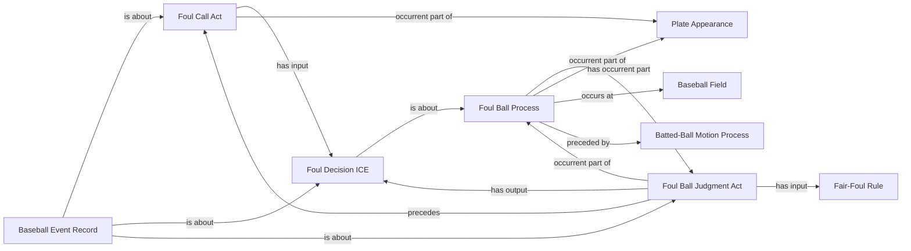

<!-- Generated by scripts/generate_rml_mermaid.py; do not edit. -->
<!-- Mapping SHA-256: 9a3db3cb5b1910df091581beef2527d2be68ec9d03699dce645c1b3a20bbe611 -->

# Foul-ball adjudication

The foul-ball process contains a distinct judgment that uses the fair/foul rule, produces a decision, and precedes a call act.

This view shows the ontology pattern without MLB JSON paths or RML machinery.

## RML evidence boundary

Generated from: `FoulBallProcessMap`, `FoulBallProcessAdjudicationPartMap`, `FoulBallAdjudicationMap`, `FoulBallDecisionMap`, `FoulBallCallMap`, `FoulBallAdjudicationRecordMap`, `FairFoulRuleMap`.
