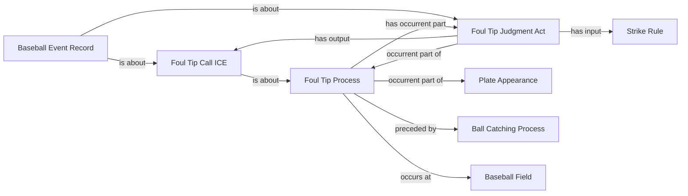

<!-- Generated by scripts/generate_rml_mermaid.py; do not edit. -->
<!-- Mapping SHA-256: bc17e2b9f57294d3456d628659686c0b73a95287999ec6cb26d7fb99be7f00f7 -->

# Foul-tip adjudication

The foul-tip process contains a distinct judgment and decision while the event record remains about the adjudication evidence.

This view shows the ontology pattern without MLB JSON paths or RML machinery.

## RML evidence boundary

Generated from: `FoulTipProcessMap`, `FoulTipProcessAdjudicationPartMap`, `FoulTipAdjudicationMap`, `FoulTipDecisionMap`, `FoulTipAdjudicationRecordMap`.
