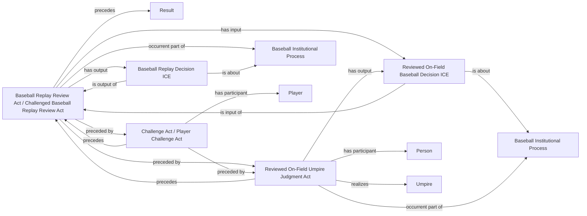

<!-- Generated by scripts/generate_rml_mermaid.py; do not edit. -->
<!-- Mapping SHA-256: ef70601419120731d914fe59980ec1dbefa4ce070f2bbca8ce5b46dbea3cb112 -->

# Replay review core

A reviewed on-field judgment produces the prior decision and leads to a distinct replay-review act that produces a replay decision; only source-described challenges create a Challenge Act or challenged-review classification.

This view shows the ontology pattern without MLB JSON paths or RML machinery.

## RML evidence boundary

Generated from: `ReviewOnFieldJudgmentMap`, `ReviewOnFieldDecisionMap`, `ReviewChallengeMap`, `ReviewPlayerChallengeMap`, `PitchReviewOnFieldUmpireMap`, `ReplayReviewActMap`, `ChallengedReplayReviewActMap`, `ReplayDecisionMap`.
