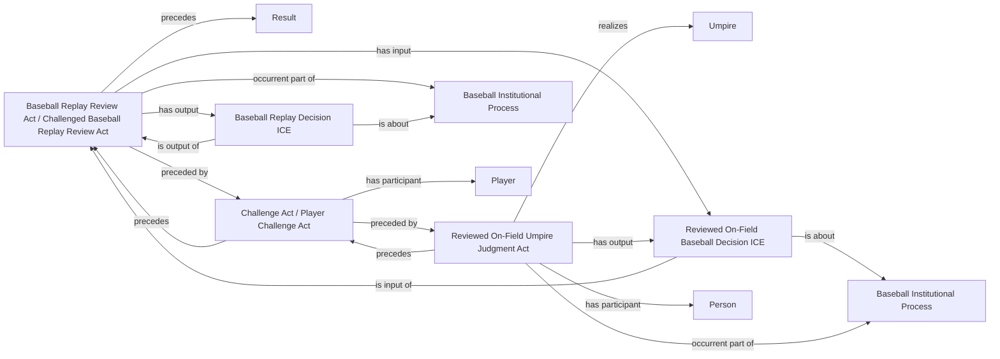

<!-- Generated by scripts/generate_rml_mermaid.py; do not edit. -->
<!-- Mapping SHA-256: ca2bfcd3533f154819be7138ce97981ad9af101d0152bc154d5eac8049dde31a -->

# Replay review core

A reviewed on-field judgment produces the prior decision, precedes a challenge, and leads to a distinct replay-review act that produces a replay decision.

This view shows the ontology pattern without MLB JSON paths or RML machinery.

## RML evidence boundary

Generated from: `ReviewOnFieldJudgmentMap`, `ReviewOnFieldDecisionMap`, `ReviewChallengeMap`, `ReviewPlayerChallengeMap`, `PitchReviewOnFieldUmpireMap`, `ReplayReviewActMap`, `ReplayDecisionMap`.
