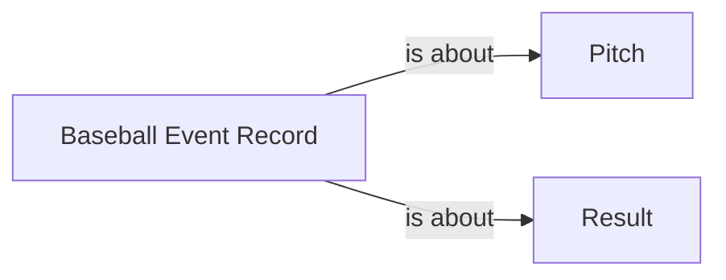

<!-- Generated by scripts/generate_rml_mermaid.py; do not edit. -->
<!-- Mapping SHA-256: bc17e2b9f57294d3456d628659686c0b73a95287999ec6cb26d7fb99be7f00f7 -->

# Replay review provenance

A review event record preserves MLB's review type and disposition, describes the final play judgment, and links pitch-result reviews to the final pitch.

This view shows the ontology pattern without MLB JSON paths or RML machinery.

## RML evidence boundary

Generated from: `ReviewEventRecordMap`, `PitchReviewEventRecordAboutMap`.
