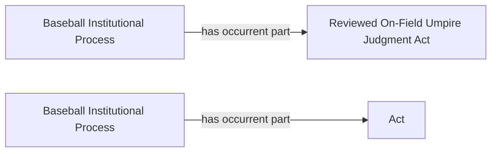

<!-- Generated by scripts/generate_rml_mermaid.py; do not edit. -->
<!-- Mapping SHA-256: f1f0054989fa91a76b8aa21a857f8b08cdeea24a88177e68a5ec0bb7ad0c493e -->

# Replay adjudicated-process contexts

The reviewed on-field judgment and replay-review act each belong to a distinct institutional process that is the subject of the corresponding decision.

This view shows the ontology pattern without MLB JSON paths or RML machinery.

## RML evidence boundary

Generated from: `ReviewOnFieldAdjudicatedProcessMap`, `ReplayAdjudicatedProcessMap`.
