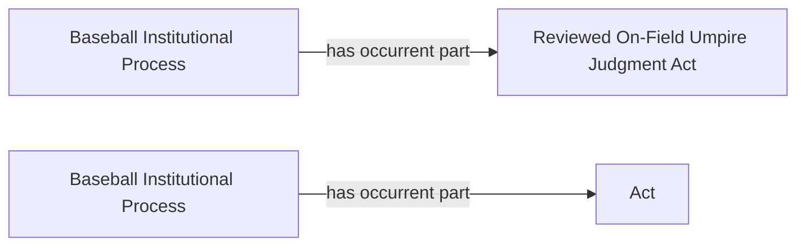

<!-- Generated by scripts/generate_rml_mermaid.py; do not edit. -->
<!-- Mapping SHA-256: bed3f052e82a896b8529c67b8e2a5c9746b06eef0788276d70bec48335fb63a4 -->

# Replay adjudicated-process contexts

The reviewed on-field judgment and replay-review act each belong to a distinct institutional process that is the subject of the corresponding decision.

This view shows the ontology pattern without MLB JSON paths or RML machinery.

## RML evidence boundary

Generated from: `ReviewOnFieldAdjudicatedProcessMap`, `ReplayAdjudicatedProcessMap`.
