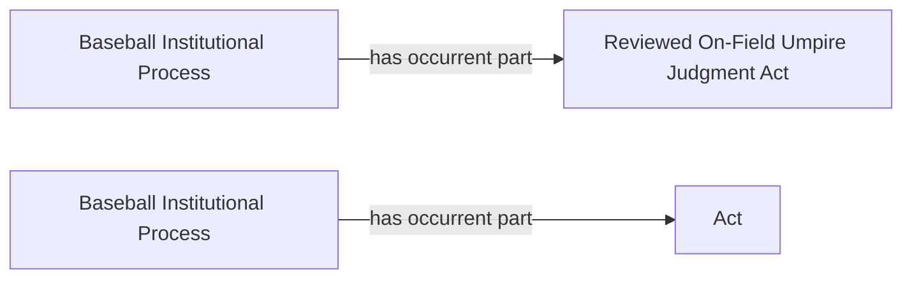

<!-- Generated by scripts/generate_rml_mermaid.py; do not edit. -->
<!-- Mapping SHA-256: eb537822e4bab673851aa84bf233b33843d82c93e6cce031fecfd402d6c46950 -->

# Replay adjudicated-process contexts

The reviewed on-field judgment and replay-review act each belong to a distinct institutional process that is the subject of the corresponding decision.

This view shows the ontology pattern without MLB JSON paths or RML machinery.

## RML evidence boundary

Generated from: `ReviewOnFieldAdjudicatedProcessMap`, `ReplayAdjudicatedProcessMap`.
