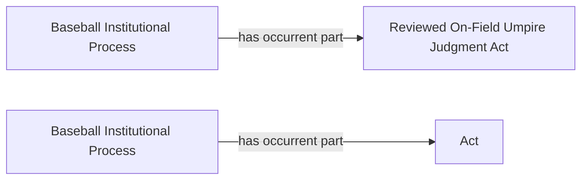

<!-- Generated by scripts/generate_rml_mermaid.py; do not edit. -->
<!-- Mapping SHA-256: 37e351d9222ab97ed1a8846f3c69bbfbd97ce933eba9ffa0215d9dddc77f8211 -->

# Replay adjudicated-process contexts

The reviewed on-field judgment and replay-review act each belong to a distinct institutional process that is the subject of the corresponding decision.

This view shows the ontology pattern without MLB JSON paths or RML machinery.

```mermaid
flowchart LR
    N01["Act"]
    N02["Reviewed On-Field Umpire Judgment Act"]
    N03["Baseball Institutional Process"]
    N04["Baseball Institutional Process"]
    N03 -->|has occurrent part| N02
    N04 -->|has occurrent part| N01
```

## RML evidence boundary

Generated from: `ReviewOnFieldAdjudicatedProcessMap`, `ReplayAdjudicatedProcessMap`.
